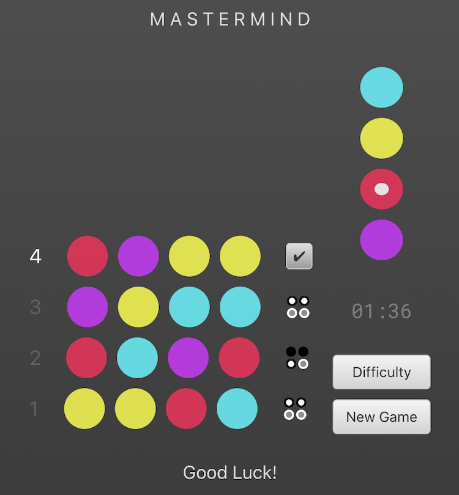
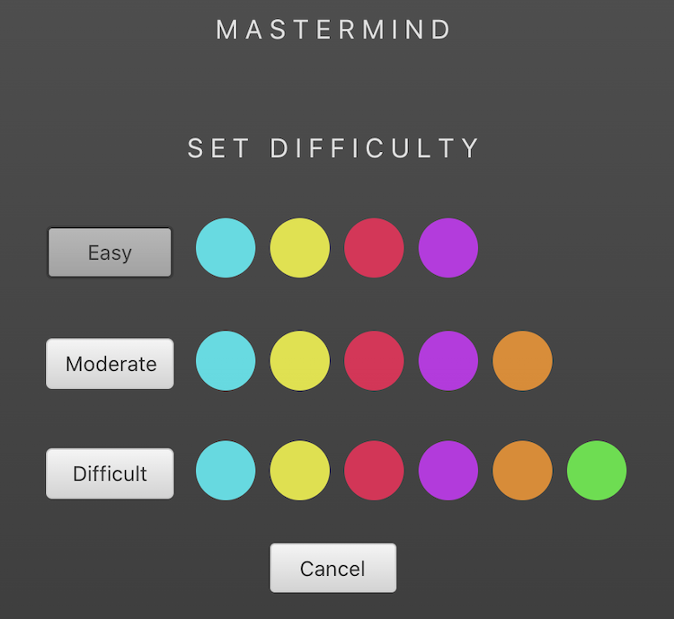

### Date: 4/20/2020

#### By: Michael Lackey
#### [Website](https://michaellackey.com/) | [GitHub](https://github.com/mlackey9601) | [LinkedIn](https://www.linkedin.com/in/michaelglackey/) | [GA Profile](https://profiles.generalassemb.ly/michaellackey)
***

### ***Description***

##### The logic game 'Mastermind' created in ReactJS.
***

### ***Technologies Used***

* ##### HTML5
* ##### CSS3
* ##### JavaScript
* ##### MongoDB/Mongoose
* ##### NodeJS/ExpressJS
* ##### ReactJS
* ##### Heroku
***

### ***Getting Started***

##### Try to duplicate the exact color sequence. The code can be made up of any combination of colored pegs.
##### The project was deployed using Heroku and can be viewed [here](https://mastermind-atx.herokuapp.com/).
***

### ***Screenshots***

###### Gameplay

###### Set Difficulty

***

### ***Future Updates***

- [x] ~~Add a difficulty setting~~
- [x] ~~Restyle the app~~
- [x] ~~Add a 'leaderboard'~~
***
